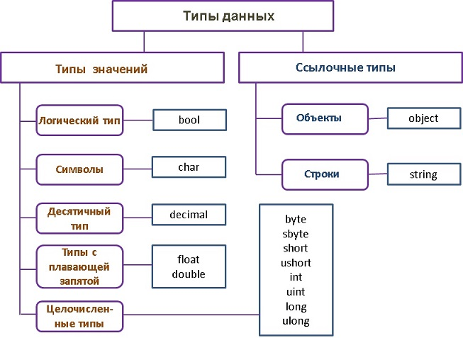

# 2. Основы программирования

## 2.1 Структура программы

### 2.1.1 Инструкции

- Инструкций - это базовый строительный блок, представляющий собой какое-то действие (арифм. операция, вызов метода и др)
- Заканчивается (;)

```csharp
Console.WriteLine("hello");
```

### 2.1.2 Регистрозависимость

Два ниже приведенных примера различаются

```csharp
var a = 10;
```

```csharp
var A = 10;
```

### 2.1.3 Комментарии

- для пояснения кода
- при компиляции игнорируются
- бывают строчными и блочными

```csharp
// строчный комментарий

/*
    многострочный комментарий
*/

```

## 2.2 Переменные и константы

- переменные - именованная область памяти, в которой хранится значение определенного типа
- переменная имеет тип, имя и значение
- значение переменной в ходе разработки программы можно менять многократно

```csharp
// тип, название и значение
int number = 10; // 10

number = 20; // 20
```

### 2.2.1 Константы

- при объявлении `обязательно` инициализировать
- после инициализации, `значение изменить нельзя`

```csharp
const int number = 10; // 10

number = 20; // error
```

## 2.3 Литералы

- это значения (`20`, `true`, `"string"`)
- логические, целочисленные, вещественные, символьные, строчные и null

## 2.4 Типы данных

- тип данных - это внутреннее представление данных. Множество значений, которые может принимать объект



### 2.4.1 Использование суффиксов

- все вещественные значения рассматриваются по умолчанию как тип double
- F/f - float, M/m - decimal

```csharp
var num1 = 1.1; // double
var num2 = 1.1f; // float
var num3 = 1.1m; // decimal
```

### 2.4.2 Использование системных типов

- int и System.Int32 - это одно и тоже, просто есть сокращенная запись системного типа

```csharp
int num = 10;
System.Int32 num = 10;
```

### 2.4.3 Неявная типизация. Ключевое слово var

- При компиляции компилятор сам определяет тип данных исходя из присвоенного значения

Особенности:

- опеределил и инициализировал
- нельзя присвоить null
- нельзя использовать константой

```csharp
var num = 10;

var num;
num = 10; // error (1)

var num = null; // error (2)

const var num = 10; // error (3)
```

## 2.5 Консольный ввод-вывод

```csharp
string? name = Console.ReadLine(); // консольный ввод. Метод ReadLine возвращает string?

Console.WriteLine($"hello, {name}"); // консольный вывод (такой формат вывода называется интерполяцией)
Console.WriteLine("Name: {0}", name); // консольный вывод (такой формат вывода можно назвать плейсхолдер)

int number = Convert.ToInt32(Console.ReadLine()); // для получения целого числа прибегаем к конвертации
Console.WriteLine(number);
```

## 2.6 Преобразования базовых типов данных

- при преобразовании следует учитывать диапазон значений, который может принимать определенный тип
- арифметические операции возвращают тип int

```csharp
byte num1 = 10;
byte num2 = num1 + 10; // error
```

### 2.6.1 Сужающие и расширяющие преобразования

- одни расширяют размер объекта в памяти, другие - сужают
- при сужающем преобразовании, нам надо применить явное преобразование

### 2.6.2 Явные и неявные преобразования

- неявные (implicit) преобразования - компилятор за нас выполняет все преобразования данных

```csharp
int num1 = 10;
long num2 = num1; // implicit
```

- явные (explicit) преобразования - надо самим применить операцию преобразования (`операция ()`)

```csharp
long num1 = 10;
int num2 = (int)num1; // explicit
```

### 2.6.3 Ключевое слово checked

- к примеру, если два каких-то значения (a + b) дадут в сумме 300, а тип byte имеет диапазон 256, то результатом будет совершенно другое значение
- при использовании checked - приложение будет генерировать исключение о переполнеии OverflowException

```csharp
int num1 = 100;
int num2 = 200;

byte result = (byte)(num1 + num2); // 300 - 256 = 44

Console.WriteLine(result);
```

```csharp
int num1 = 100;
int num2 = 200;

byte result = checked((byte)(num1 + num2)); // error: OverflowException

Console.WriteLine(result);
```

## 2.7 Условные выражения

### 2.7.1 Логические операции

- операция | и операция || - проверяют одно и то же, но (| - проверяет два операнда) и (|| - проверяет сначала первый, затем другой)
- таким образом операции || и && сокращают время на вычисление значений и тем самым повышают производительность

```csharp
var num1 = 5;
var num2 = 6;

var result1 = (num1 > 3) | (num2 < 3); // true |(||) false = true
var result2 = (num1 > 3) & (num2 < 3); // true &(||) false = false
```

- операция исключающее ИЛИ (^) - если два операнда одинаковы, то false

```csharp
var num1 = 5;
var num2 = 6;

var result1 = (num1 > 3) ^ (num2 > 3); // true ^ true = false
var result2 = (num1 > 3) ^ (num2 < 3); // true ^ false = true
```

## 2.8 Циклы

- конструкции, котороые в зависимости от определенного условия могут выполнить некоторое действие множество раз
- for, foreach, while, do..while

```csharp
for (int i = 1; i < 10; i++) { }
// ---
foreach (int i in new int[] { 0, 1, 2, 3, 4, 5 }) { }
// ---
var number = 10;

do
{
    Console.WriteLine(number--);
} while (number > 0);
// ---
var number = 10;

while (number > 0)
{
    Console.WriteLine(number--);
}
```

### 2.8.1 foreach

- предназначен для перебора набора значений
- цикл последовательно перебирает набор значений (коллекцию) и помещает их в переменную, и далее мы можем использовать значение с этой переменной

### 2.8.2 for

- в цикле for можно изменять элементы набора значений
- можно перескакивать на несколько элементов вперед

### 2.8.3 continue и break

- break - чтобы выйти из цикла
- continue - перескочить на новую итерацию

## 2.9 Массивы

- набор однотипных данных

```csharp
int[] numbers1;
int[] numbers2 = new int[1];
int[] numbers3 = new int[1] { 1 };
int[] numbers4 = new int[] { 1, 2, 3 };
int[] numbers5 = new[] { 1, 2, 3, 4 };
int[] numbers6 = { 1, 2, 3, 4, 5 };
```

- для обращения к элементам массива используются индексы (нумерация начинается с 0)

```csharp
int[] numbers = { 1, 2, 3 };
Console.WriteLine(numbers[1]); // 2
```

- можно получить длину массива

```csharp
int[] numbers = { 1, 2, 3 };
Console.WriteLine(numbers.Length); // 3
```

- как получить последний элемент массива

```csharp
int[] numbers = { 1, 2, 3 };

Console.WriteLine(numbers[numbers.Length - 1]); // 3
Console.WriteLine(numbers[^1]); // 3
```

### 2.9.1 Многомерные массивы

- характеризуются таким понятием как ранг (количество измерений)
- одномерные массивы - 1 ранг

```csharp
int[,] numbers = { { 1, 2 }, { 3, 4 } };
Console.WriteLine(numbers.Length); // 4 - return int
Console.WriteLine(numbers.LongLength); // 4 - return long
Console.WriteLine(numbers.Rank); // 2
```

### 2.9.2 Массив массивов

- зубчатый массив
- длина массива указывается только в первых квадратных скобок, все последующие пусты

```csharp
var numbers = new int[2][];
numbers[0] = new int[] { 1, 2, 3 };
numbers[1] = new int[] { 4, 5, 6 };

Console.WriteLine(numbers.Length); // 2
Console.WriteLine(numbers.LongLength); // 2
Console.WriteLine(numbers.Rank); // 1
```

```csharp
var numbers = new int[2][,];
numbers[0] = new int[,] { { 1, 2 }, { 1, 2 } };
numbers[1] = new int[,] { { 1, 2 }, { 1, 2 } };

Console.WriteLine(numbers.Length); // 2
Console.WriteLine(numbers.LongLength); // 2
Console.WriteLine(numbers.Rank); // 1

Console.WriteLine(numbers[0].Length); // 4
Console.WriteLine(numbers[0].LongLength); // 4
Console.WriteLine(numbers[0].Rank); // 2
```

### 2.9.3 Основные понятия массивов

- ранг - количество измерений
- длина измерений - длина отдельного измерения массива
- длина массива - количество всех элементов массива

```csharp
int[,] numbers = new int[3, 4];

// ранг - 2
// длина измерений - 3, 4
// длина массима - 12
```

## 2.10 Методы

- именованный блок кода, который выполняет какое-то действие
- преимуществом метода является то, что его можно повторно использовать в разных частях программы

```csharp
void PrintHello()
{
    Console.WriteLine("Hello");
}
```

### 2.10.1 Параметры метода

- формальные - параметры метода
- фактические - значения передаваемые параметрам метода

```csharp
void PrintMessage(string message) // Формальные параметры
{
    Console.WriteLine($"message: {message}");
}

/*
  Result: 'message: hello'
  ---
  Фактические параметры
*/
PrintMessage("hello");
```

### 2.10.2 Необазятаельные параметры

- для параметров можно указать значения по умолчанию
- после такие параметров последующие тоже должны быть необязательными
- для таких параметров можно не передавать значение

```csharp
void PrintSum(int a, int b = 10, int c = 20)
{
    Console.WriteLine($"Result: {a + b + c}");
}

PrintSum(1); // 31
PrintSum(1, 2); // 23
PrintSum(1, 2, 3); // 6
```

### 2.10.3 Именованные параметры

- значение для параметров передаются в том порядке, в котором параметры определены
- можно нарушить порядок используя именованные параметры

```csharp
void PrintSum(int x, int y, int z)
{
    Console.WriteLine($"Result: {x + y + z}");
}

PrintSum(y: 2, z: 2, x: 3); // 7
```

## 2.11 Возвращение значения и оператор return

- оператор return не только возвращает значение, но и производит выход из метода

```csharp
string GetMessage(string message)
{
    return message;
}
// ---
string GetError(string error) => error;
// ---
void ReturnExample()
{
    if (2 > 1) return;

    Console.WriteLine("Some string");
}

Console.WriteLine(GetMessage("message"));
Console.WriteLine(GetError("error"));
ReturnExample();
```

## 2.12 Передача параметров по ссылке и значению. Выходные параметры

### 2.12.1 Передача параметров по значению

- при передаче параметров по значению, мы получаем не саму переменную, а ее копию

```csharp
void Sum(int x)
{
    x = x + 1;
    Console.WriteLine(x); // 11
}

var x = 10;
Console.WriteLine(x); // 10;
Sum(x); 
Console.WriteLine(x); // 10;
```

### 2.12.2 Передача параметров по ссылке и модификатор ref

- при передаче парамтеров по ссылке используется модификатор ref. То есть метод получает адрес переменной в памяти
- если происходит изменение значения в методе, то и снаружи оно поменяется
- модификатор указывает как в объявлении параметра в метода, так и при вызове метода перед аргументом

```csharp
void Sum(ref int x)
{
    x = x + 1;
    Console.WriteLine(x); // 11
}

var x = 10;
Console.WriteLine(x); // 10;
Sum(ref x); 
Console.WriteLine(x); // 11;
```

### 2.12.3 Выходные параметры. Модификатор out

- методы использующие такие параметры - должны обязательно присвоить им значение
- помимо того, что он ссылочный, мы можем вернуть с метода не одно, а несколько значений

```csharp
void Sum(int x, int y, out int result)
{
    result = x + y;
}

int result;

Sum(10, 10, out result);

Console.WriteLine(result); // 20
```

### 2.12.4 Входные параметры. Модификатор in

- передается по ссылке
- значение такого параметра нельзя будет изменить
- передача по ссылке в некоторых случаях может повысить производительность

```csharp
void Sum(in int x, in int y, out int result)
{
    // x = 15; error
    result = x + y;
}

Sum(10, 10, out int result);
Console.WriteLine(result); // 20
```

## 2.13 Массив параметров и ключевое слово params

- с помощью params можно передавать неопределенное количество параметров
- использование params при определении должен представлять одномерный массив
- должен стоять в конце параметров

```csharp
void Sum(int initVal, params int[] numbers)
{
    for (int i = initVal; i < numbers.Length; i++)
    {
        Console.WriteLine($"number-{i}: {numbers[i]}");
    }
}

Sum(0, 5, 4, 3, 2, 1);
Sum(0, new int[] { 10, 20, 30 });
```

### 2.13.1 Массив в качестве параметра

- если передаем массив без ключевого слова, то мы обязательно передаем только массив
- после параметра (массив), можно располагать другие параметры

### 2.14 Локальные функции

- это функции, которые определены внутри других методов
- содержит действия, которые применяются только в рамках ее метода
- если такая функция больше в программе не будет нигде вызыватся, то целесообразно определить ее внутри метода

```csharp
void SumPositiveNumbers(params int[] numbers)
{
    int GetPositiveValue(int value) => value > 0 ? value : 0;

    int result = 0;
    for (int i = 0; i < numbers.Length; i++)
    {
        result += GetPositiveValue(numbers[i]);
    }
    Console.WriteLine($"Result: {result}");
}

SumPositiveNumbers(new int[] { 1, 2, -3, -4, -5 }); // 3
```

#### 2.14.1 Статические локальные функции

- определяются с ключевым словом static
- не имеют доступа к переменным внутри метода, где определена

### 2.15 Конструкция switch

- оценивает какое-то выражение и сравнивает его значение с набором значений
- значение выражения последовательно сравнивается со значениями идущих в case
- операторы перехода: break, goto case, return, throw
- есть необязательный блок default - если совпадения не найдено
- конструкция может возвращать некоторое значение

```csharp
var num = 1;

switch (num)
{
    case 0:
        Console.WriteLine(0);
        break;
    case 1:
        Console.WriteLine(1);
        break;
    default:
        Console.WriteLine("Error");
        break;
}
```

```csharp
var num = 4;

int result = num switch
{
    1 => 1,
    2 => 2,
    _ => 3
};

Console.WriteLine(result); // 3
```

## 2.16 Перечисления enum

- значимый тип
- набор логически связанных констант
- начинается с нуля (0)
- порядок можно изменить
- используется как хранение состояния
- константы могут иметь тип (целочисленный). По умолчанию - int
- чтобы получить целочисленные значние, надо сделать преобразование

```csharp
const DayTime dayTime = DayTime.Morning;
Console.WriteLine((int)dayTime); // 0

enum DayTime : int
{
    Morning,
    Afternoon,
    Evening,
    Night
}
```
