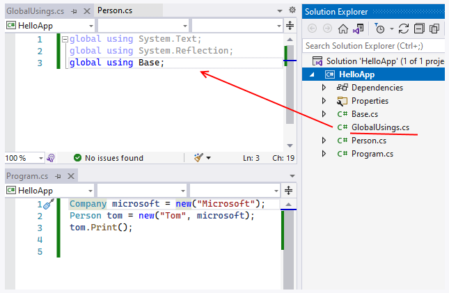
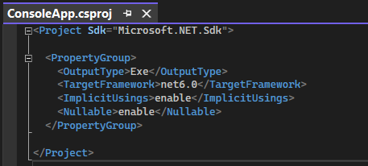
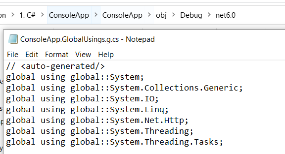

# 1. Классы и объекты

- C# - объктно-ориентированный язык программирования
- Программа в виде взаимосвязанных взаимодействующих между собой объектов
- Класс - описание объекта
- Объект - экземпляр класса

```csharp
class Person
{

}
```

## 1.1 Поля и методы класса

### 1.1.1 Общие представления

- класс хранит какие-то данные (поля) и определяет логически-связанные действия
- чтобы методы и поля были видны вне класса, используются модификатор

### 1.1.2 Поля

- поля класса - переменные определенные на уровне класса
- поля класса о отличие от переменных определенных в методах имеют модификатор доступа
- при определении полей мы можем присвоить м значения
- если поля не проинициалиизрованы они получают значение по умолчанию, (числовые - 0)

### 1.1.3 Методы

- методы класса определяют его поведение
- методы класса имеют доступ к его полям

```csharp
class Person
{
    public string name = "Undefined";
    public int age;

    public void Pring()
    {
        Console.WriteLine(name + " " + age);
    }
}

```

## 1.2 Создание объекта класса

- после определения класса, можно создать его объект
- для создания объекта применяется конструктор
- конструктор - инициализация объекта
- оператор `new` выделяет память под объект
- в итоге в памяти будет создан участок, где будут хранится данные этого объекта, сама переменная `person` получит ссылку на созданный объект

```csharp
var person = new Person();
person.name = "Eduard";
person.age = 23;
person.Pring(); // Eduard 23
```

## 1.3 Конструктор по умолчанию

- если в классе не определено конструкторов, то по умолчанию автоматически создается для него пустой конструктор без параметров

## 1.4 Константы классы

- кроме полей класс может определять для хранения данных константы
- константы хранят данные, которые относятся не к одному объекту, а ко всему классу в целом
- для обращения к константам используется имя класса, а не имя объекта

```csharp
var person = new Person();
Console.WriteLine(person.type); // error
Console.WriteLine(Person.type); // correct

class Person
{
    public const string type = "Person";
}
```

# 2. Конструкторы, инициализаторы и деконструкторы

## 2.1 Создание конструкторов

- если в классе определены свои конструкторы, то класс лишается конструктора по умолчанию
- конструкторы могут иметь модификаторы доступа
- в классе можно определять много конструкторов

```csharp
var person1 = new Person(); // error
var person2 = new Person("Eduard"); // correct

class Person
{
    private string _name;

    public Person(string name)
    {
        _name = name;
    }
}
```

```csharp
var person1 = new Person("Eduard");
var person2 = new Person("Eduard", 23);


class Person
{
    private string _name;
    private int _age;

    public Person(string name)
    {
        _name = name;
    }

    public Person(string name, int age)
    {
        _name = name;
        _age = age;
    }
}
```

- начиная с С# 9 мы можем сократить вызов конструктора

```csharp
Person person1 = new ("Eduard");
Person person2 = new ("Eduard", 23);
```

## 2.2 Ключевое слово this

- this - ссылка на текущий объект/экземпляр класса
- используется, чтобы разграничеть поля класса и параметры конструктора
- используется, чтобы обращаться из одного конструктора к другому передавая нужные значения для параметров (чтобы не дублировать функциональность конструкторов)

```csharp
class Person
{
    public string name;

    public Person(string name)
    {
        this.name = name; // Пример 1
    }
}
```

## 2.3 Цепочка вызова конструкторов

По количеству и типу параметров компилятор узнает, какой именно конструктор вызывается.

В данном случае первый конструктор вызовет второй, второй вызовет третий. Причем вначале выполняется третий конструктор, потом второй и затем первый

```csharp
var person1 = new Person(); // Рассмотрим этот пример
var person2 = new Person("Eduard");
var person3 = new Person("Eduard", 23);
person1.Print(); // Name: Undefined, Age: 0
person2.Print(); // Name: Eduard, Age: 0
person3.Print(); // Name: Eduard, Age: 23

class Person
{
    private string _name;
    private int _age;

    public Person() : this("Undefined")
    {
    }

    public Person(string name) : this(name, 0)
    {
    }

    public Person(string name, int age)
    {
        _name = name;
        _age = age;
    }

    public void Print()
    {
        Console.WriteLine($"Name: {_name}, Age: {_age}");
    }
}
```

## 2.4 Инициализаторы объектов

- применяются для инициализации объектов класса
- представляют передачу в фигурных скобках значений доступным полям и свойствам (`разбор позже`) класса

### 2.4.1 Основные моменты

- Установка значений для доступных полей и свойств объекта
- Инициализатор выполняется после конструктора

```csharp
var person1 = new Person() { name = "Eduard", age = 23 }; // error
var person2 = new Person() { name = "Eduard" };

class Person
{
    public string name;
    private int _age;
}
```

## 2.5 Деконструкторы

- синтаксический сахар
- декомпозируют объект на отдельные части
- значения переменным из деконструктора передаются по позиции

```csharp
var person = new Person("Eduard", 23);

(string name, int age) = person;
(int age, string name) = person; // error
Console.WriteLine($"Name: {name}, Age: {age}");

class Person
{
    private string _name;
    private int _age;

    public Person(string name, int age)
    {
        _name = name;
        _age = age;
    }

    public void Deconstruct(out string name, out int age)
    {
        name = _name;
        age = _age;
    }
}
```

- при получении значений из деконструктора, нам необходимо предоставить столько переменных, сколько деконструктор возвращает значений
- если нужно получить не все значения из деконструктора, а конкретные, можно воспользоваться знаком прочерк (\_)

```csharp
(_, int age) = person;
Console.WriteLine($"Age: {age}");
```

# 3. Класс Program и метод Main. Программы верхнего уровня

- Visual Studio 2022 создает `программу верхнего уровня` без класса Program и метода Main
- Код неявно помещается компилятором в метод Main, а сам метод в класс Program
- Теперь следует учитывать, что определения типов (к примеру, классов) должны идти в конце файла после инструкций верхнего уровня (примером может служить выше класс Person)

# 4. Структуры

- еще один способ создание собственного типа наряду с классами
- значимый тип
- могут хранить данные в виде полей/свойств и определять действия в виде методов

```csharp
var person = new Person();
person.name = "Eduard";
person.age = 23;
person.Print();

struct Person
{
    public string name;
    public int age;

    public void Print()
    {
        Console.WriteLine($"Name: {name}, Age: {age}");
    }
}
```

## 4.1 Создание объекта структуры

- можно создать и описать объект структуры без конструктора, что надо сделать это присвоить всем доступным полям значения

```csharp
Person person;
person.name = "Eduard";
person.age = 23;
person.Print();

// ---

Person person;
person.name = "Eduard";
// person.age = 23;
person.Print(); // error
```

## 4.2 Инициализация полей по умолчанию

- с версии C# 10, мы можем напрямую инициализировать поля структруры при их определении (до этой так делать было нельзя)
- однако в этом случае, необходимо явно определить и вызвать конструктор, если мы хотим использовать эти значения

```csharp
var person = new Person();
person.Print();


struct Person
{
    public string name = "Eduard";
    public int age = 23;

    public Person()
    {

    }

    public void Print()
    {
        Console.WriteLine($"Name: {name}, Age: {age}");
    }
}
```

## 4.3 Конструкторы структуры

- можно определять конструктор, в котором обязательно инициализировать все поля структуры

```csharp
var person = new Person();
person.Print();

struct Person
{
    public string name;
    public int age;

    // Такой конструктор доступен с версии C# 10
    public Person()
    {
        name = "Eduard";
        age = 23;
    }

    // ИЛИ такой конструктор

    public Person(string name, int age)
    {
        this.name = name;
        this.age = age;
    }

    public void Print()
    {
        Console.WriteLine($"Name: {name}, Age: {age}");
    }
}
```

## 4.4 Копирование структуры с помощью with

- мы можем копировать значения из одного объекта структуры в другой

```csharp
var eduard = new Person("Eduard", 23);
var tom = eduard with { name = "Tom" };
eduard.Print(); // Eduard 23
tom.Print(); // Tom 23
```

# 5. Типы значений и ссылочные типы (Внимательно)

- Значимые типы: int и др., а также enum и struct
- Ссылочные типы: object, string, class, interface, delegate

Память делить на два типа: стек и куча.

- Значимые типы, хранятся в стеке - время жизни таких объектов ограничено их контекстом
- Ссылочные типы, хранятся в куче

При создании объекта ссылочного типа, в стеке помещается ссылка на адрес в куче. Когда объект ссылочного типа перестает использоваться, то в дело вступает сборщик мусора. Он видит, что на объект в куче нету ссылок, условно удаляет этот объект и очищает память.

# 6. Область видимости (контекст) переменных и констант

- каждая переменная доступна в рамках определенного контекста, вне этого контекста переменная не существует
- контексты: класса, метода, блока кода

# 7. Пространства имен

- Пространства имен - организовывают код программы в логические блоки

```csharp
var person = new Person(); // error

namespace Base
{
    class Person
    {
        private string _name;

        public Person(string name)
        {
            _name = name;
        }

        public void Print() => Console.WriteLine($"Name: {_name}");
    }
}

// ---


var person = new Base.Person("Eduard");
person.Print();

namespace Base
{
    class Person
    {
        private string _name;

        public Person(string name)
        {
            _name = name;
        }

        public void Print() => Console.WriteLine($"Name: {_name}");
    }
}
```

- Чтобы не использовать название пространства имен, его нужно подключить с мощью оператора `using`

```csharp
using Base;

var person = new Person("Eduard");
person.Print();
```

- пространства имен могут быть вложенными

## 7.1 Пространства имен уровня файла

- в версии C# 10 можно определять пространства имен на уровне файла

Как это сделать:

1. создать файл .cs
2. написать нужный код
3. подключить в другой файл и использовать

```csharp
namespace Base;

public class Person
{
    public int Id { get; set; }
}
```

# 8. Глобальные пространства имен

- это когда все пространство имен подключается один раз, но сразу во все файлы кода

```csharp
global using подключаемое_пространство_имен;
```

## 8.1 Определение глобальных пространств в отдельном файле

- создать новый файл .cs
- определить пространства имен



# 9. Подключение пространств имен по умолчанию

Если нажать на проект в Solution Explorer и выбрать Edit Project File, то мы увидим .csproj файл.



В нем есть строка, которая говорит, что подключить в файлы пространства имен по умолчанию

```xml
<ImplicitUsings>enable</ImplicitUsings>
```

После компиляции проекта, в папке obj/Debug/net6.0 можно найти файл, в котором глабально перечислены используемые пространства имен



Конечно же, это можно отключить и подключать пространства имен вручную.

## 9.1 Подключение и отключение пространств по отдельности

Подключение

```xml
<Project Sdk="Microsoft.NET.Sdk">

  <PropertyGroup>
    <OutputType>Exe</OutputType>
    <TargetFramework>net6.0</TargetFramework>
    <ImplicitUsings>disable</ImplicitUsings>
    <Nullable>enable</Nullable>
  </PropertyGroup>

  <ItemGroup>
    <Using Include="System" />
    <Using Include="System.Threading.Tasks" />
  </ItemGroup>

</Project>
```

Отключение

```xml
<Project Sdk="Microsoft.NET.Sdk">

  <PropertyGroup>
    <OutputType>Exe</OutputType>
    <TargetFramework>net6.0</TargetFramework>
    <ImplicitUsings>enable</ImplicitUsings>
    <Nullable>enable</Nullable>
  </PropertyGroup>

  <ItemGroup>
    <Using Remove="System" />
    <Using Remove="System.Threading.Tasks"/>
  </ItemGroup>

</Project>
```

# 10. Модификаторы доступа

- компоненты класса имеют модификаторы доступа
- задает доступную область видимости для компонентов класса
- с помощью модификаторов можно скрывать некоторые реализации класса от других частей программы

Виды модификаторов:
- private
- private protected
- protected
- internal
- protected internal
- public


- модификаторы применяются помимо компонентов класса и к компонентам структуры за тем исключением, что структуры не могут использовать модификаторы (private protected, protected, protected internal), поскольку структуры не могут быть унаследованы
- компоненты класса или структуры по умолчанию модификатор private
- классы и структуры по умолчанию internal, а вложенные классы и структуры, как и остальные компоненты имеют модификатор private

# 11. Свойства

- свойство - посредник между внешним кодом и какой-то переменной
- обеспечивают доступ к полям класса и структуры
- можно получить и установить значение

```csharp
var person = new Person();

Console.WriteLine(person.Name); // Undefined

person.Name = "Eduard";

Console.WriteLine(person.Name); // Eduard

class Person
{
    private string _name = "Undefined";

    public string Name
    {
        get => _name;
        set => _name = value;
    }
}
```

- свойства позволяют по сравнению с обычными полями, вложить дополнительную логику, которая может быть необходима при установке или получении значения

```csharp
var person = new Person();

Console.WriteLine(person.Name); // Undefined

person.Name = "Test Name";

Console.WriteLine(person.Name); // Undefined

person.Name = "Eduard";

Console.WriteLine(person.Name); // Eduard

class Person
{
    private string _name = "Undefined";

    public string Name
    {
        get => _name;
        set
        {
            _name = value.Equals("Eduard") ? "Eduard" : "Undefined";
        }
    }
}
```

- блоки get и set не обязательно должны присутствовать вместе

## 11.1 Вычисляемые свойства

- свойства не обязательно должны быть связаны с какой-то переменной

```csharp
var person = new Person("Eduard", "Popkov");
Console.WriteLine(person.FullName); // Eduard Popkov

class Person
{
    private string _firstName;
    private string _lastName;

    public Person(string firstName, string lastName)
    {
        _firstName = firstName; 
        _lastName = lastName;
    }

    public string FullName => $"{_firstName} {_lastName}";
}
```

## 11.2 Модификаторы доступа

- применять модификаторы можно не только ко всему свойству, но и к отдельным блокам

Ограничения:
- установить модификатор для отдельных блоков можно, если в свойстве присутствует оба блока
- только один блок может иметь модификатор
- модификатор блока более ограничивающий, чем модификатор свойства

## 11.3 Автоматические свойства

- сокращенная форма
- в любой момент времени можно развернуть автосвойства в обычное и добавить дополнительную логику
- нельзя создавть автосвойство только для записи, по сравнению с обычными
- автосвойствам можно присвоить значение по умолчанию

```csharp
public string Name { get; set; }

public string Name { set; } // error

public string Name { get; set; } = "Eduard";
```

- если оставляем только блок get, то это свойство неявно создается с модификатором readonly (установка значения при объявлении или в конструкторе)

## 11.4 Блок init

- С# 9.0
- этот блок призван инициализировать свойство
- установка значения через инициализатор, либо при объявлении, либо в конструкторе
- после установки значения подобного свойства, его значение изменить нельзя, они становятся readonly (и есть еще способ установки через другое свойство)
- разница от readonly, что можно установить значение в инициализаторе

```csharp
var person = new Person() { Name = "Eduard" }; // correct

person.Name = "Eduard"; // error

class Person
{
    public string Name { get; init; } = "Eduard"; // correct

    public Person()
    {
        Name = "Eduard"; // correct
    }
}
```

# 12. Перегрузка методов

- создание метода с одним и тем же именем но с разной сигнатурой

Сигнатура:
- имя метода
- количество параметров
- типы параметров
- порядок параметров
- модификаторы параметров

```csharp
class Calculator
{
    public int Sum(int x, int y) => x + y;
    public int Sum(int x, int y, int z) => x + y + z;
}
```

# 13. Статические члены и модификатор static

- статические поля, свойства, методы относятся ко всему классу/cтруктуре, а не к объекту

## 13.1 Статические поля / свойства

- в самом классе, мы можем использовать такое поле как обычное
- если обращение к этому поле вне класса, то только с использованием имени класса
- на уровне памяти, для таких полей будет создаваться участок в памяти, который будет общим для всех объектов класса (для статических переменных создается участок в памяти все равно, даже если не создано ни одного объекта)

```csharp
var test = new Test();
test.number = 10; // error
test.Print();

Console.WriteLine(Test.number); // 10

Test.number = 20;

Console.WriteLine(Test.number); // 20

class Test
{
    public static int number = 10;

    public void Print() => Console.WriteLine(number);
}
```

## 13.2 Статические методы

- статические методы могут обращаться только к статическим членам класса

## 13.3 Статический конструктор

- без модификатора доступа
- не принимают параметры
- внутри нельзя использовать ключевое слово this
- обращаться только к статическим членам класса
- их нельзя вызвать в программе вручную. Они выполняются автоматически один раз при первом создании объекта данного класса или при первом обращении к его статическим членам
- используются для инициализации статических данных, либо же выполняют действия, которые требуется выполнить только один раз

```csharp
var person = new Person();
/*
 * Result: 
 * 1) static constructor
 * 2) no-static constructor
*/

class Person
{
    static Person()
    {
        Console.WriteLine("Static constructor");
    }

    public Person()
    {
        Console.WriteLine("No-static constructor");
    }
}
```

## 13.4 Статические классы

- объявляются с модификатором static
- содержат только статические поля, свойства и метода

# 14. Поля и структуры для чтения

- поля для класса или структуры
- их значение нельзя изменить
- значение можно установить только при определении переменной или в конструкторе

## 14.1 Сравнение констант

- константы должны быть инициализированы во время компиляции, а readonly во время выполнения программы
- константы не могут использовать модификатор static, т.к. неявно являются статическим. Readonly - могут быть static, и не быть

## 14.2 Структуры для чтения

- особенность таких структур, что все их поля должны быть readonly

```csharp
readonly struct Person
{
    public readonly string Name = "Eduard";

    public Person()
    {
        Name = "Eduard";
    }
}
```

# 15. Null и ссылочные типы

- Microsoft создал такую опцию, чтобы указывать на опасные части кода, где мы можем столкнуться с NullReferenceException.
- в файле .csproj мы можем отключить такую опцию
- переменную ссылочного типа следует инициализировать конкретным значением, ей не следует присваивать значение null
- переменной ссылочного типа можно присвоить значение null, но перед использованием необходимо проверять на null

```csharp
string? name = null;
```

## 15.1 nullable-контекст на уровне участка кода

- можно включить nullable-контекст на уровне отдельных участков кода

```csharp
#nullable enable
 
string? message = null;
PrintUpper(message);

void PrintUpper(string? message)
{
    Console.WriteLine(message.ToUpper()); // указывает на место, где может быть NullReferenceException
}
```

## 15.2 Оператор ! (null-forgiving operator)

- убирает предупреждение об ошибке
- предназначен для статического анализа компилятора

```csharp
string? message = null;
PrintUpper(message!);

void PrintUpper(string message)
{
    if (message == null)
    {
        Console.WriteLine("null");
        return;
    }

    Console.WriteLine(message.ToUpper());
}
```

## 15.3 Исключение кода из nullable-контекста

- с помощью директивы можно исключить определенный кусок кода из nullable-контекста

```csharp
#nullable disable
    string text = null; // здесь nullable-контекст не действует
#nullable restore
 
string? name = null;   // здесь nullable-контекст снова действует
```

# 16. Null и значимые типы

- значимые типы не могут иметь значение null
- чтобы переменная значимого типа могла иметь значение null, надо ее сделать nullable (знак вопроса (?) или Nullable<int>)

```csharp 
int? number1 = null;
Nullable<int> number2 = null;
```

## 16.1 Свойства Value и HasValue и метод GetValueOrDefault

- если попробовать получить значение через свойство Value, которое null, то мы получим ошибку
- метод GetValueOrDefault - возвращает значение, если оно не равно null или значение по умолчанию

```csharp
int? number = null;

var result = number.HasValue ? number.Value : 0;

Console.WriteLine(result); // null
```

## 16.2 Операции с nullable-типами

- nullable-типы поддерживают арифметические операции, но если в операции учавствует nullable-тип, то результатом будет тоже nullable-тип

```csharp
int? x = 1;
int y = 1;
int result1 = x + y; // error
int? result2 = x + y; // correct
```

- если один из операндов равен null, то результат тоже null
- в операциях сравнения, если хоть один из операндов равен null, то возвращается false

```csharp
int? x = null;
int y = 1;
Console.WriteLine(x + y); // null
```

# 17. Проверка на null, операторы ?. и ??

- ниже приведены проверки на null
- также провка на тип данных 
- такие проверки называются null guard

```csharp
string? message = null;
string? error = "Not null";

if (message == null) Console.WriteLine("Null");
if (message is null) Console.WriteLine("Null");
if (error is not null) Console.WriteLine("Not null");
if (error is string) Console.WriteLine("string");
```

## 17.1 Оператор ??

- возвращает левый операнд, если не равен null
- работает с переменными, которые могут принимать значение null

```csharp
int? number1 = null;
int? number2 = 20;

Console.WriteLine(number1 ?? 100); // 100
Console.WriteLine(number2 ?? 200); // 20
```

```csharp
int x = 10;
int y = 20;
int result = x ?? y; // error
```

# 18. Псевдонимы типов и статический импорт

## 18.1 Псевдонимы

- для классов и структур мы можем использовать псевдонимы, потом по ним обращаться к классам и структурам

```csharp 
using User = Person;

var person = new User();

class Person { }
```

## 18.2 Статический импорт

- подключает все статические свойства и метода, а также константы
- после можно не указывать название класса

```csharp
using static System.Console;

WriteLine("Hello World!!!");
```