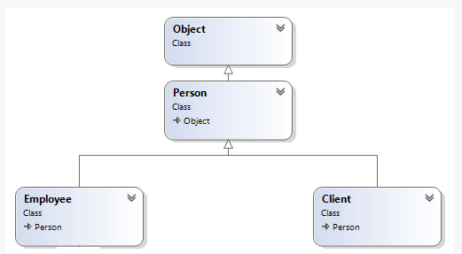
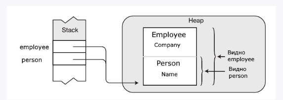

# 1. Объектно-ориентированное программирование

## 1.1 Наследование

- один класс унаследывает функциональность другого
- при наследовании не передаются конструкторы базового класса с параметрами
- т.к. все классы наследуются от System.Object, они имеют такие методы как (ToString, Equals, GetHashCode, GetType)

```csharp
var person = new Person("Eduard");
person.Print();

var employee = new Employee();
employee.Name = "Emma";
employee.Print();

var employee2 = new Employee("Eduard"); // error

class Person
{
    public string? Name { get; set; }

    public Person()
    {

    }

    public Person(string name)
    {
        Name = name;
    }

    public void Print()
    {
        Console.WriteLine($"Name: {Name}");
    }
}

class Employee : Person { }
```

Ограничения при наследовании:

- не поддерживается множественное наследование классов
- дочерний класс должен иметь модификатор доступа такой же или более ограничивающий. (Следует учитывать, что если родитель и наследник находятся в разных сборках, то наследник может наследоваться только от базового класса с модификатором public)
- класс с модификатором sealed наследовать нельзя
- нельзя наследоваться от статического класса

## 1.2 Ключевое слово base

- с помощью этого ключевого слова можно обратиться к базовому классу

```csharp
var person = new Person("Eduard");
person.Print();

var employee = new Employee("Emma", "Finteco");
employee.Print();

class Person
{
    public string? Name { get; set; }
    public Person(string name)
    {
        Name = name;
    }

    public void Print()
    {
        Console.WriteLine($"Name: {Name}");
    }
}

class Employee : Person
{
    public string? Company { get; set; }

    public Employee(string name, string company)
        : base(name)
    {

    }
}
```

## 1.3 Конструкторы в производных классах

- если в базовом классе не определен коструктор без параметров, а только с параметрами, то в производном классе мы обязаны вызвать один из конструкторов базового класса с помощью ключевого слова base
- либо определить в базовом класса конструктор без параметров

## 1.4 Порядок вызова конструкторов

- вызываются сначала конструкторы базовых классов

```csharp
var person1 = new Person("Eduard");
// Result: Person (name)
var person2 = new Person("Eduard", 23);
// Result: Person (name), Person (name, age)
var person3 = new Employee("Eduard", 23, "Finteco");
// Result: Person (name), Person (name, age), Employee (name, age, company)

class Person
{
    private string _name;
    private int _age;

    public Person(string name)
    {
        _name = name;
        Console.WriteLine("Person (name)");
    }

    public Person(string name, int age) : this(name)
    {
        _age = age;
        Console.WriteLine("Person (name, age)");
    }
}

class Employee : Person
{
    private string _company;

    public Employee(string name, int age, string company)
        : base (name, age)
    {
        _company = company;
        Console.WriteLine("Employee (name, age, company)");
    }
}
```

# 2. Преобразование типов

```csharp
class Person
{
    public string Name { get; set; }

    public Person(string name)
    {
        Name = name;
    }

    public void Print()
    {
        Console.WriteLine($"Person: {Name}");
    }
}

class Employee : Person
{
    public string Company { get; set; }

    public Employee(string name, string company)
        : base(name)
    {
        Company = company;
    }
}

class Client : Person
{
    public string Bank { get; set; }

    public Client(string name, string bank)
        : base(name)
    {
        Bank = bank;
    }
}
```



## 2.1 Восходящие преобразования. Upcasting

- от производного к базовому
- переменные client и person указывают на один и тот же объект в памяти, но переменной person доступна только та чать, которая представляет функционал типа Person

```csharp
Client client = new Client("Eduard", "Prior");
Person person = client;
person.Name = "Emma";
person.Bank = "MTB"; // error
```



## 2.2 Нисходящие преобразования. Downcasting

- от базового к производному

```csharp
Client client = new Client("Eduard", "Prior");
Person person = client;
person.Name = "Emma";
person.Bank = "MTB" // error;
Client client2 = (Client)person;
client2.Name = "Eduard";
client2.Bank = "Prior";
Client client3 = person; // error
```

## 2.3 Способы преобразований

- ключевое слово as - попытка преобразования, которая не выбрасывает исключение, а в случае неудачи возвращает null

```csharp 
Person person = new Person("Eduard");
Client? client = person as Client;

if (client == null)
{
    Console.WriteLine("Null");
}
```

- ключевое слово is - проверяет допустимость преобразования, возвращает true | false
- второй вариант использования. Если преобразование допустимо, то в переменной client хранятся данные

```csharp
Person person = new Person("Eduard");

var isClient = person is Client;
if(!isClient)
{
    Console.WriteLine("Person isn't client!");
}

Person person = new Person("Eduard");

if (person is not Client client)
{
    Console.WriteLine("Person isn't client!");
}
```

# 3. Виртуальные методы и свойства

- переопределение
- чтобы изменить в классе наследнике функционал базового класса
- доступно переопределение методов, свойств
- запрет переопределения sealed
- допустим метод. В базовом классе помечается как virtual, а в наследнике - override
- если метод помечен как virtual - его не обязательно переопределять. Он доступен для переопределения

```csharp
var employee = new Employee("Eduard", "Finteco");
employee.Print(); // Employee: Eduard - Finteco

class Person
{
    public string Name { get; set; }

    public Person(string name)
    {
        Name = name;
    }

    public virtual void Print()
    {
        Console.WriteLine($"Person: {Name}");
    }
}

class Employee : Person
{
    public string Company { get; set; }

    public Employee(string name, string company)
        : base(name)
    {
        Company = company;
    }

    public override void Print()
    {
        Console.WriteLine($"Employee: {Name} - {Company}");
    }
}
```

- Виртуальные методы базового класса определяют интерфейс всей иерархии, то есть в любом производном классе, который не является прямым наследником базового, можно переопределить виртуальные методы

```csharp
var manager = new Manager("Eduard", "Finteco", "Junior Software Developer");
manager.Print(); // Employee: Eduard - Finteco - Junior Software Developer

class Person
{
    public string Name { get; set; }

    public Person(string name)
    {
        Name = name;
    }

    public virtual void Print()
    {
        Console.WriteLine($"Person: {Name}");
    }
}

class Employee : Person
{
    public string Company { get; set; }

    public Employee(string name, string company)
        : base(name)
    {
        Company = company;
    }

    public override void Print()
    {
        Console.WriteLine($"Employee: {Name} - {Company}");
    }
}

class Manager : Employee
{
    public string Position { get; set; }

    public Manager(string name, string company, string position)
        : base (name, company)
    {
            Position = position;    
    }

    public override void Print()
    {
        Console.WriteLine($"Manager: {Name} - {Company} - {Position}");
    }
}
```

Ограничения при переопределении: 
- одинаковый модификатор доступа у методов
- нельзя переопределить или сделать виртуальным статический метод

# 4. Скрытие методов и свойств

- сокрытие - другой способ изменить функциональность базового класса
- для сокрытия используется ключевое слово new
- сокрытие используется, если метод или свойство в базовом классе не является виртуальным, мы не можем его переопределить, но мы хотим изменить поведение метода или свойства в производном классе

```csharp
var person = new Person("Eduard");
person.Print(); // Name: Eduard

var employee = new Employee("Emma", "Finteco");
employee.Print(); // Name: Emma, Company: Finteco

class Person
{
    public string Name { get; set; }

    public Person(string name)
    {
        Name = name;
    }

    public void Print()
    {
        Console.WriteLine($"Name: {Name}");
    }
}

class Employee : Person
{
    public string Company { get; set; }

    public Employee(string name, string company)
        : base(name)
    {
        Company = company;
    }

    public new void Print()
    {
        Console.WriteLine($"Name: {Name}, Company: {Company}");
    }
}
```

## 4.1 Скрытие переменных и констант

- в отличии от переопределения C# позволяет применить сокрытие к переменным (и к статическим) и к константам

```csharp
Console.WriteLine(Person.minAge);     // 1
Console.WriteLine(Person.typeName);   // Person
 
Console.WriteLine(Employee.minAge);     // 18
Console.WriteLine(Employee.typeName);   // Employee
 
class Person
{
    public readonly static int minAge = 1;
    public const string typeName = "Person";
}
class Employee : Person
{
    // скрываем поля и константы базового класса
    public new readonly static int minAge = 18;
    public new const string typeName = "Employee";
}
```

# 5. Различие переопределения и скрытия методов

## 5.1 Переопределение

```csharp
Person person = new Employee("Eduard", "Finteco");
person.Print(); // Eduard работает в Finteco

class Person
{
    public string Name { get; set; }

    public Person(string name)
    {
        Name = name;
    }

    public virtual void Print()
    {
        Console.WriteLine(Name);
    }
}

class Employee : Person
{
    public string Company { get; set; }

    public Employee(string name, string company)
        : base(name)
    {
        Company = company;
    }

    public override void Print()
    {
        Console.WriteLine($"{Name} работает в {Company}");
    }
}
```

Для работы с виртуальными методами компилятор формирует таблицу виртуальных методов. В нее записываются адреса виртуальных методов. Для каждого класса создается своя таблица. Когда создается объект класса, компилятор передает в конструктор объекта специальный код, который связывает объект с виртуальной таблицей. При вызове виртуального метода из объекта берется адрес его таблицы. Затем из таблицы извлекается адрес метода и ему передается управление. 

Следует учитывать, что CLR вначале надо получить адрес нужного метода из таблицы, это замедляет выполнение программы.

## 4.2 Скрытие

- В сокрытии работает наоборот, переменная person типа Person хранит ссылку на объект типа Employee. При вызове метода Print вызывается версия метода из типа Person.

Т.к. класс Employee никак не переорпделяет метод Print, а фактически определяет новый метод

# 5. Абстрактные классы и члены классов

# 5.1 Абстрактные классы

- похож на обычный класс
- определяется с ключевым слово abstract
- главное отличие, что мы не можем использовать конструктор абстракного класса для создания объекта. Но можем определять конструкторы

## 5.2 Абстрактные члены классов

- абстрактные члены класса не должны иметь модификатор private
- производный класс обязан переопределить и реализовать все абстрактное, используя модификатор override

Абстрактными могут быть:
- метода - определение без реализации
- свойства
- индексаторы
- события

В случае с виртуальными методами мы говорим, что класс-наследник наследует реализацию.

В случае с абстрактными методами мы говорим, что класс наследник наследует интерфейс, представленый этими абстрактными методами.

## 5.3 Отказ от реализации абстрактных членов

- производный класс, должен быть определен как abstract